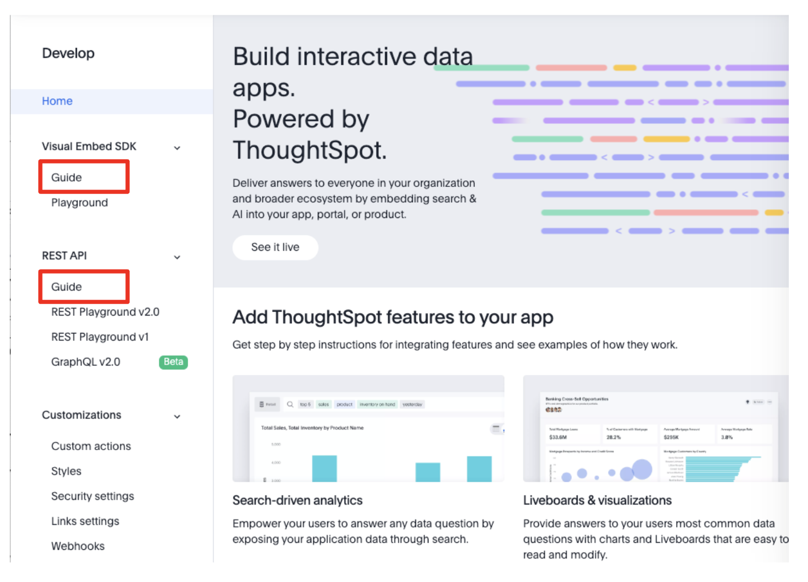
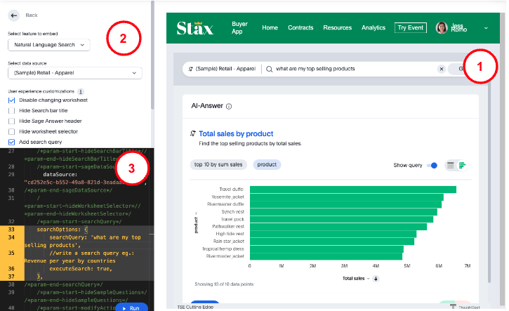
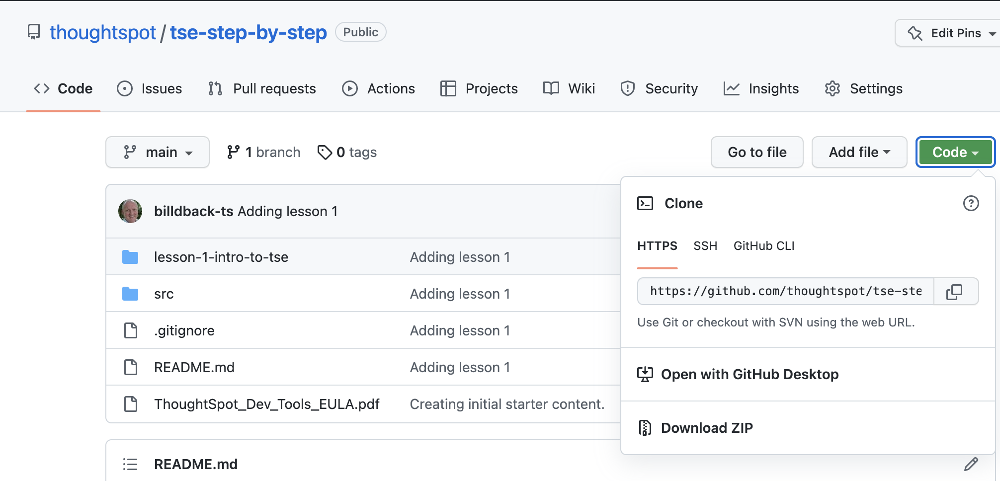

# Lesson 2: Setting up for the course

In this lesson we'll go through the requirements to get set up for the course. By the end, you should be in a position
to do all the lessons and exercises. Specific topics include:

* The pre-conditions that need to be satisfied.
* Reviewing the TSE documentation.
* Gaining familiarity with the Developer's Playground.
* Downloading the starter code.

## Pre-conditions

You should also have a ThoughtSpot developer account with TSE enabled. If you don't already have an account, you can
create a [trial account](https://www.thoughtspot.com/trial?tsref=ts-dev-training) that's good for 30 days and has TSE
enabled.

You will also need the following:

* A modern web browser. We'll use Chrome in the examples, but you should be able to use other browsers like Firefox or
  Safari.
* A text editor for editing code. You can use any text editor, but an IDE that support HTML, CSS, and Javascript will
  work better. The examples in this course use Visual Studio Code, a popular IDE web development.
* A web server to run the code. We'll be running a very basic web application, so you don't need a complex web server.
  This course will use [Live Server](https://marketplace.visualstudio.com/items?itemName=ritwickdey.LiveServer) which is
  available in the Visual Studio Marketplace. With this installed, you can start and stop the server with a single
  click.

## Review the TSE documentation

ThoughtSpot provides detailed documentation about embedding and the SDK. There are two places you can get the
documentation. First, you can use the documentation from the developer documentation
site: [https://developers.thoughtspot.com/docs](https://developers.thoughtspot.com/docs)

The second location is in the ThoughtSpot Develop tab. The image below shows the links to the documentation for the
visual embed SDK Guide and the REST API Guide.

## Become familiar with the playground

Click the Playground link in the "Develop" tab under "Visual Embed SDK" (see the image above) and you will open the
Playground. The playground is an area that lets you quickly and easily generate working code that you can embed into
your application. The following image shows an example using a natural language search embed.

The image above has three main sections:

1. The first section shows a preview of how your embedded analytics. As you make changes and run the code you get to see
   the results. This is what the code would look like in your application (ignoring any style differences). This is a
   great benefit to using the playground, because errors will also show up.
2. The second section allows you to choose different options. At the top is a dropdown that lets you specify the type of
   content you are embedding. The options below the dropdown differ based on the content selected.
3. The third and final section is the code that is being run. This code is interactive and can be modified and then run
   using the (Run) button. The code can be updated using the selections in section two or by modifying the code
   directly. The code section has smart code completion that can help enter the appropriate values.

## Download the code

Before beginning, you should download the code from [GitHub](https://github.com/thoughtspot/tse-step-by-step/). The
recommended approach is to use the [`git clone`](https://github.com/git-guides/git-clone) command to make a local copy, perhaps
after [forking](https://docs.github.com/en/get-started/quickstart/fork-a-repo) the code base. If you don't want to take
this route (or don't know what those commands are), then you can also just download the code using the Download Zip
option as shown in the image below.

`git clone https://github.com/thoughtspot/tse-step-by-step/`

## Activities

1. Explore the documentation site.
2. Log in as a Developer and explore the "Develop" tab. All users on the free trial have Developer privileges.
3. Open the Visual Embed SDK Playground, modify content and run the resulting code to become familiar with the code.
4. Download the code or clone the repository.

[< prev](../lesson-01-intro-to-tse/README-01.md) | [next >](../lesson-03-security-setup/README-03.md)
