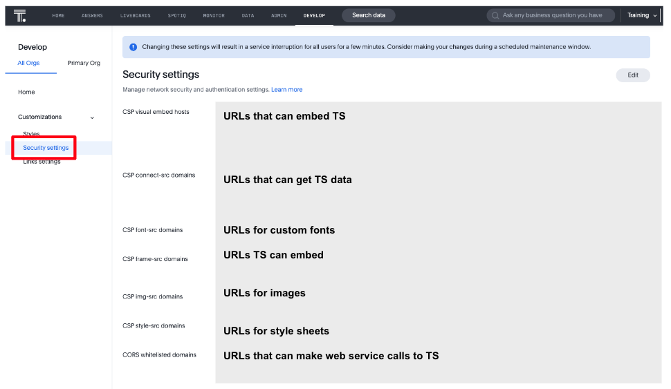

# Lesson 3: Security Setup

TSE applications operate securely with ThoughtSpot. This lesson will walk you through the security setup to be able to
embed ThoughtSpot.

## Pre-conditions

You should have already completed the settings
in [Lesson 2 - Setting up for the course](/lesson-02-setting-up/README-02.md). In addition, to change the security
settings in ThoughtSpot you need to be an administrator or have an administrator to set the proper settings.
Furthermore, if you are using an org-enabled instance of ThoughtSpot, some settings are set in the Primary org only.  
This lesson will show the instance level settings.

## Types of Security

Security is applied to web applications in many ways. In the case of TSE, there are some that are TSE specific and some
that are ThoughtSpot specific. This lesson focuses on the TSE specific security, but we'll describe all types before
getting into the details.

Security when using ThoughtSpot and TSE can be thought of in the following buckets that work together to apply
end-to-end content and data security. Each type of security is identified below with where the security is managed (TSE
or ThoughtSpot).

* (TSE) Embed / web security are the security settings that allow you to embed ThoughtSpot into your application.
* (TSE and ThoughtSpot) Authentication determines how you will authenticate the user with ThoughtSpot. Both the
  authentication supported by ThoughtSpot and TSE have to be considered.
* (ThoughtSpot) Content security is managed by ThoughtSpot to determine what content a user has access to, such as
  table, worksheets, and liveboards. Data security can be controlled separately (see below).
* (ThoughtSpot) System privileges / roles define what a user can do inside ThoughtSpot, such as download data or use
  SpotIQ.
* (ThoughtSpot) Data security restricts the columns or rows of data from the source data. Data security is managed
  via row-level security settings or column sharing in ThoughtSpot. It can also be controlled using passthrough security
  to the cloud data warehouse.

## Embed / Web Security

The embed and web security settings determine which applications can embed ThoughtSpot and make API calls via
JavaScript (cross-site scripting).

Security settings are (mostly) set using the Developer -> Security Settings tab in the ThoughtSpot UI. You can see this
page if you have Developer or Administrator privileges. To make changes you will need to have Administrator privileges.

The following are the most important settings for embedding TS. Except for very simple embedding scenarios, all of these
are typically set for the URL of the TSE application embedding TS.

### CSP visual embed hosts

CSP visual embed hosts are the URLs that are permitted to embed ThoughtSpot. For
example, `https://mycoolapp.mycompany.com`. If your app URL is not in the list then you will get CSP errors when
embedding. For development, you can add localhost, but it's not recommended for production environments. You only need a
port if you are using a non-standard (e.g. 80, 443) port.

### CSP connect-src domains

The CSP connect-src domains are those domains that you can send data _to_. This is mostly used
for [custom actions](https://developers.thoughtspot.com/docs/?pageid=customize-actions) (covered later), including both
callback and URL actions. This setting has the same constraints as the CSP visual embed hosts. Failure to set this
setting can also result in CSP errors.

### CORS whitelisted domains

CORS whitelisted domains are those domains that can use cross-site scripting, i.e. calling web service endpoints (
including login) from a web application. Command line applications and tools, such as CURL are not impacted by this
setting. The values are the list of domains (without protocol) and any non-standard ports, such as 8080. If CORS isn't
set you will see CORS errors in the console log for web service calls.

For more details, see the [security setting](https://developers.thoughtspot.com/docs/?pageid=security-settings)
documentation, which also includes constraints on values for the above settings.

## Authentication

Authentication is how users are given access to ThoughtSpot (logged in) and identified in ThoughtSpot. Before a user can
be authenticated, they have to exist in ThoughtSpot, and they are usually assigned to some groups. Typically, this
assignment is a separate process, but it is possible if using SAML to create the user and assign them to groups when
doing the initial authentication. Other alternatives include manually creating users and using the APIs to create users
and groups. The creation of users and groups is not covered in this course.

The following table lists the types of authentication, the
associated [enumerated type](https://developers.thoughtspot.com/docs/Enumeration_AuthType#preamble) in the SDK and if
the users can be created on demand. Don't worry about the AuthType right now, but it will be used later when we talk
about
initializing the SDK.

| Type                                           | [AuthType](https://developers.thoughtspot.com/docs/typedoc/enums/AuthType.html) | Description                                               | Can Create? |
|------------------------------------------------|---------------------------------------------------------------------------------|-----------------------------------------------------------|-------------|
| No Authentication                              | AuthType.None                                                                   | No authentication by the SDK                              | No          |
| Basic                                          | AuthType.Basic                                                                  | Username / Password                                       | No          |
| SSO with iframe redirect                       | AuthType.EmbeddedSSO                                                            | SSO or OIDC when iframe redirect is supported by the IdP. | No          |
| [SAML](https://en.wikipedia.org/wiki/SAML_2.0) | AuthType.SAMLRedirect                                                           | SSO with SAML                                             | Yes         |
| [OIDC](https://openid.net/connect/)            | AuthType.OIDCRedirect                                                           | SSO with Open ID Connect                                  | No          |
| Trusted Authentication                         | AuthType.AuthServer                                                             | ThoughtSpot token-based approach                          | Yes         |

Each of these approaches is explored in detail in the following sections.

### No Authentication

No Authentication (AuthType.None) is exactly what it sounds like. The user is not authenticated to ThoughtSpot. If the
user isn't logged into ThoughtSpot, the embedded content will display a login page for the user to log in. This auth
type is usually only used during development, so it's not usually a problem. If you are logged into ThoughtSpot in
another tab or browser window you will be authenticated already.

### Basic Authentication

Basic authentication is traditional username / password authentication. This approach is typically only used in
development or test, but can also be used in your webapp if you prompt the user for the login info. You don't want to
put a username and password in your code because then it can be seen by viewing the source.

### EmbeddedSSO Authentication

EmbeddedSSO authentication supports both SAML 2.0 and OpenID authentication when the identity provider support iframe
redirect. Most modern IdPs support iframe redirect, so if you are using SAML or OIDC, this is the type you most likely
want to use. If iframe redirect is _not_ supported, you can use one of the following.

### SSO/SAML Authentication

SAML authentication uses SAML 2.0 to authenticate the user. With this approach, ThoughtSpot is set up within a
federation using an Identity Provider (IdP), such as Okta or something similar. When the user attempts to view
ThoughtSpot content, ThoughtSpot will make a check to the IdP to verify the user is authenticated. Usually the embedding
application is also part of the same federation, so the user is already authenticated. It's not required, but if the
user isn't authenticated, then they will have to authenticate with the IdP.

SAML configuration requires Administrator privileges in ThoughtSpot. It shows up in the Admin page of the UI. You will
need to provide information about the IdP, including uploading a metadata XML file. Details on the setting can be found
in the [documentation](https://developers.thoughtspot.com/docs/?pageid=saml-sso). The IdP will have to also be set up to
match the ThoughtSpot configuration. See the IdP's documentation on how to set it up.

Once you have the SAML federation set up for ThoughtSpot, you also have to enable the SAML redirect for the
authentication. This is set from the Developer | Security Settings. If this value is not set, then you will get errors
trying to redirect back to your application.

See the [documentation](https://developers.thoughtspot.com/docs/?pageid=saml-sso) for more details on using SAML SSO.

### OIDC Authentication

OIDC (Open ID Connect) is a newer standard based on OAuth 2.0. This auth type has been added more recently (2022) as a
supported type. OIDC configuration is not currently supported in the UI, so you will need to work with the ThoughtSpot
support team to configure OIDC.

See the [documentation](https://developers.thoughtspot.com/docs/?pageid=oidc-auth) for more details on using OIDC.

### Trusted Authentication

Trusted authentication is a ThoughtSpot specific approach to authentication that is typically used when other SSO
scenarios such as SAML or OIDC, aren't being used. Trusted Authentication is only used with TSE (including REST API
calls). With Trusted Authentication, you use a separate server that will authenticate on behalf of the user with a
secret token. This token is then used by the user to authenticate with ThoughtSpot. If the user doesn't exist, it
can be created as part of the call to get a token from ThoughtSpot.

To enable trusted authentication you have to navigate to the Developer | Security Settings page and enable it via the
toggle switch. Note that only an administrator can make this change. Once enabled, you will get a cluster wide key that
you can copy and use in API calls.  *_KEEP THIS KEY PRIVATE!_*  It is a cluster wide key that allows you to create
sessions on behalf of any user.

NOTE: On instances with Orgs enabled, you can also enable trusted authentication at the org level in addition to the
instance level. The token created can only be used to log into the given org.

See the [documentation](https://developers.thoughtspot.com/docs/?pageid=trusted-auth) for more details of using Trusted
Authentication.

## Activities

1. Review the [documentation](https://developers.thoughtspot.com/docs/?pageid=security-settings) for security settings.
2. Review the documentation for
   authentication ([SAML SSO](https://developers.thoughtspot.com/docs/?pageid=saml-sso), [OIDC](https://developers.thoughtspot.com/docs/?pageid=oidc-auth), [Trusted Authentication](https://developers.thoughtspot.com/docs/?pageid=trusted-auth)).
3. Set (or have set) the appropriate settings for your environment unless you are using the ThoughtSpot trial.

[< prev](../lesson-02-setting-up/README-02.md) | [next >](../lesson-04-start-coding/README-04.md)
