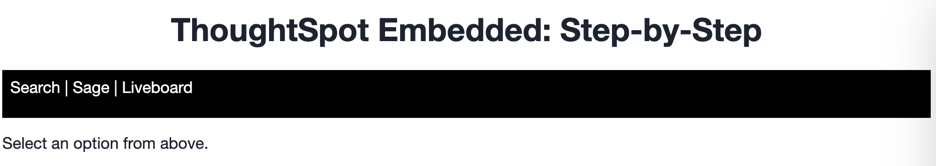
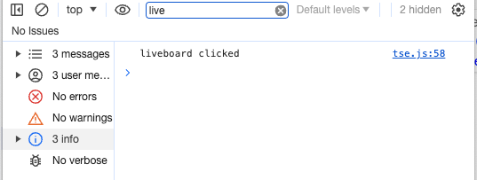
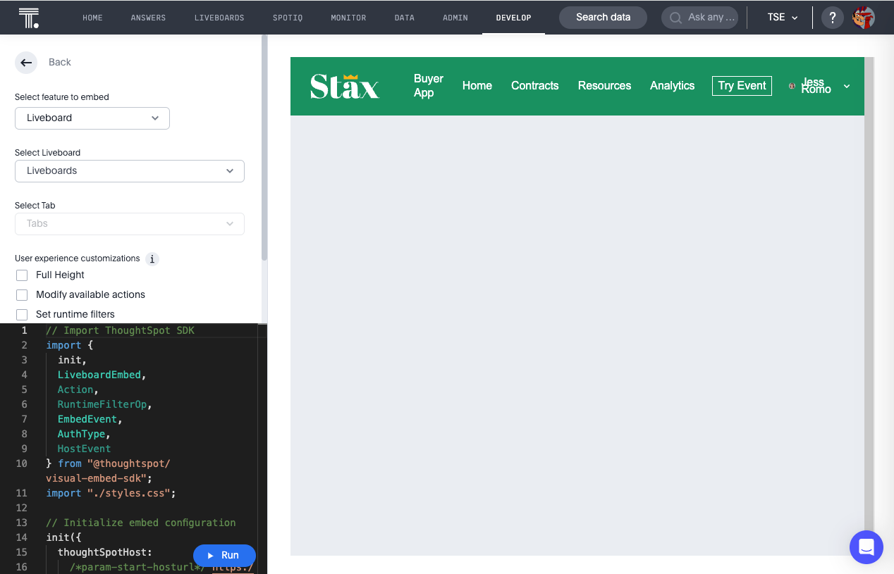
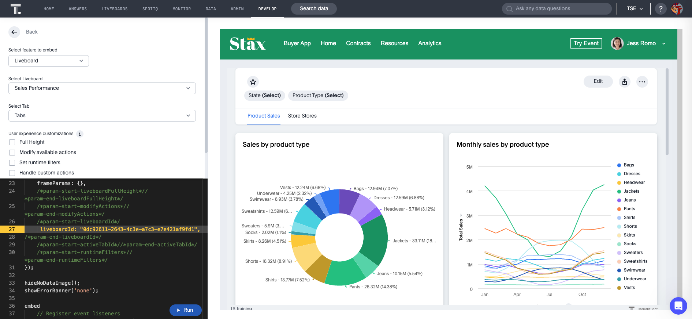
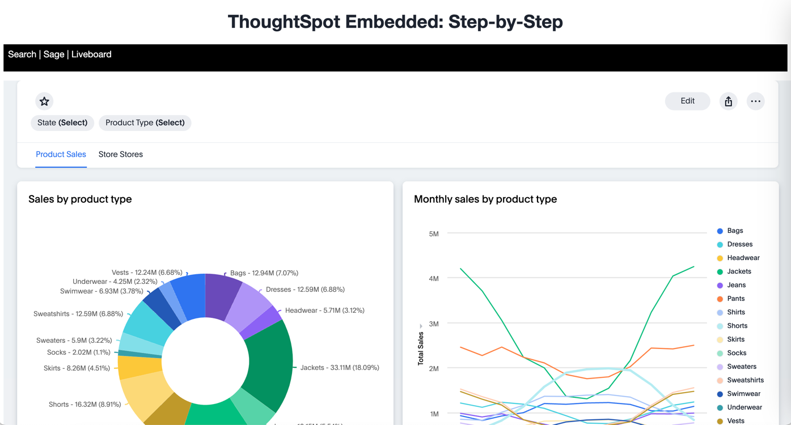

# Lesson 7 - Embed a Liveboards

In this lesson we'll embed a full liveboard using the `LiveboardEmbed` component.

## Pre-Conditions

It's ideal if you've done all the lessons so far. You minimally will need to have set up the environment and code and
have an `init` method working (see [lesson 05](../lesson-05-embed-search/README-05.md)).

## Add a nav link and function for the liveboard embed

First we want to add another nav link to the nav bar. In the `index.html` file add a new `<li>` for the separator and
the liveboard.

~~~

    <ul id="ul-nav-links">
        <li id="search-link">Search</li> <!-- lesson 05 -->
        <li>|</li>
        <li id="sage-link">Sage</li>  <!-- lesson 06 -->
        <li>|</li>
        <li id="liveboard-link">Liveboard</li>  <!-- lesson 07 -->
    </ul>

~~~

Now run the application, and you should see the new links. It doesn't do anything yet, but it's always good to test code
as we add functionality to find errors quickly. The UI could use some style work to make it easier to read, but this
layout is sufficient to learn TSE.

## Add a listener for the liveboard links

In `tse.js` add the following lines of code. It adds a listener for the click events, so when the user clicks, it will
call the `onLiveboard` function. Go ahead and add this line after the one we added for the `sage-link`.

~~~
document.getElementById('liveboard-link').addEventListener('click', onLiveboard);
~~~

Now we have to add the functions to get called. After the close of the `onSearch` function, add the following functions.
Right now they only shows a comment in the console, but that will tell you that it's being called.

~~~
const onLiveboard = () => {
  console.log('liveboard clicked');
}
~~~

Refresh the application and click on the new link. You should see a message in the console window of the developer
tools.

## Add the LiveboardEmbed to the import

In order to use the `LiveboardEmbed` component, we need to import it. At the top of the file, add LiveboardEmbed to the
list of components. You should now have an import like the following:

~~~
import {
  init,
  AuthType,
  SearchEmbed,
  LiveboardEmbed,
  Action,
} from 'https://unpkg.com/@thoughtspot/visual-embed-sdk/dist/tsembed.es.js';
~~~

## Generate a liveboard to embed

The same way you created a `SearchEmbed` component in the playground, we'll create a liveboard embed. Navigate to the
visual embed SDK playground and select `Liveboard` from the dropdown on the top left. You should see something like the
following. While search will show search page, the liveboard doesn't have a default view.

The `LiveboardEmbed` has fewer options than `SearchEmbed`. For the Liveboard you need to pick a specific liveboard from
the dropdown. Then you can specify a tab in the liveboard to start on if desired. After that, there are the following
liveboard-specific options:

* Full height - if set, this feature will cause the header to scroll up and down
* Set runtime filters - you can set (and update) runtime filters on the liveboard without a user selecting them

Let's create the liveboard component we want to embed. In this case, you just need to specify a liveboard from the
dropdown. We'll just use the defaults for the other values.

Select a liveboard from the dropdown, and you should see a `liveboardId` added to the code. Click run, and you should
see your liveboard show up in the right-hand panel.

## Embed the liveboard into the application

As with search and Sage we'll just copy the code from the playground into the application. Copy the component creation
section. It will look like the following. Comments have been removed. Paste this code into the `onLiveboard` function.

~~~
const embed = new LiveboardEmbed("#embed", {
    frameParams: {},
    liveboardId: "0dc92611-2643-4c3e-a7c3-e7e421af9fd1",
});
~~~

Now we just need to render the component. Failure to add this step results in an empty embed area.

`embed.render();`

The completed `onLiveboard` should look something like the following.

~~~
const onLiveboard = () => {
  const embed = new LiveboardEmbed("#embed", {
    frameParams: {},
    liveboardId: "0dc92611-2643-4c3e-a7c3-e7e421af9fd1",
  });

  embed.render();
}
~~~

## Test the liveboard embed

The last step is to test the embedded liveboard. Simply refresh the application (with cache disabled), then click
the `Liveboard` link, and you should get something like the following:

## Activities

1. Add the nav link and handler to your code
2. Import the LiveboardEmbed component
3. Use the playground to create the embed liveboard component
4. Copy and paste the generated code (adding render()) into your application
5. Test the code

If you run into problems, you can look at the code in the `src` folder in this section.

## Files changed

* index.html
* tse.js

[< prev](../lesson-06-embed-sage/README-06.md) | [next >](../lesson-08-embed-liveboard-viz/README-08.md)
