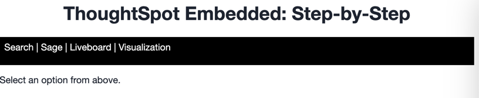
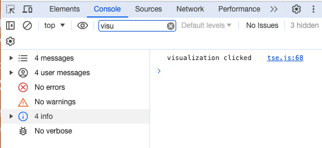
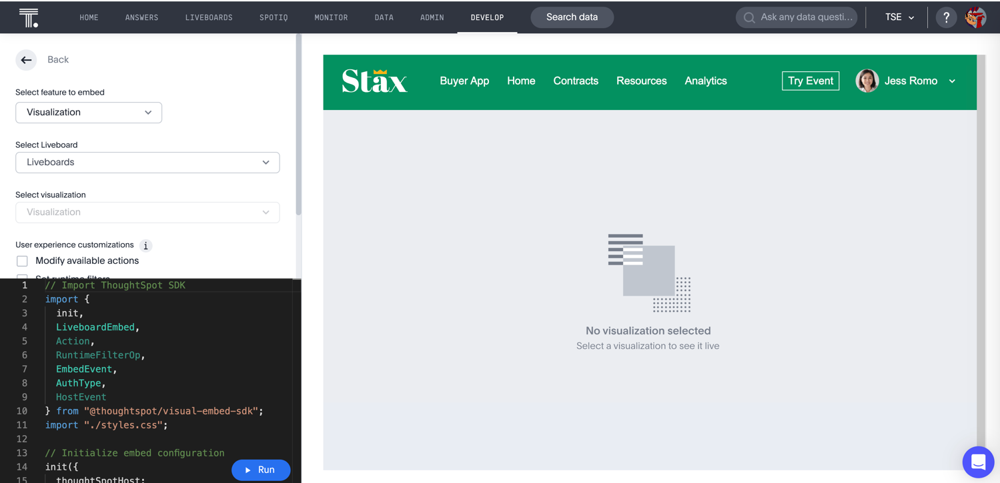
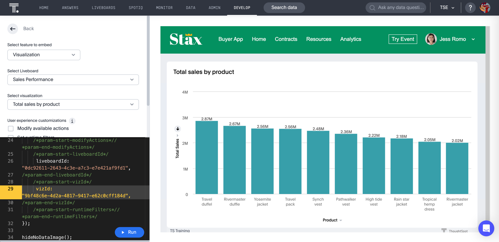
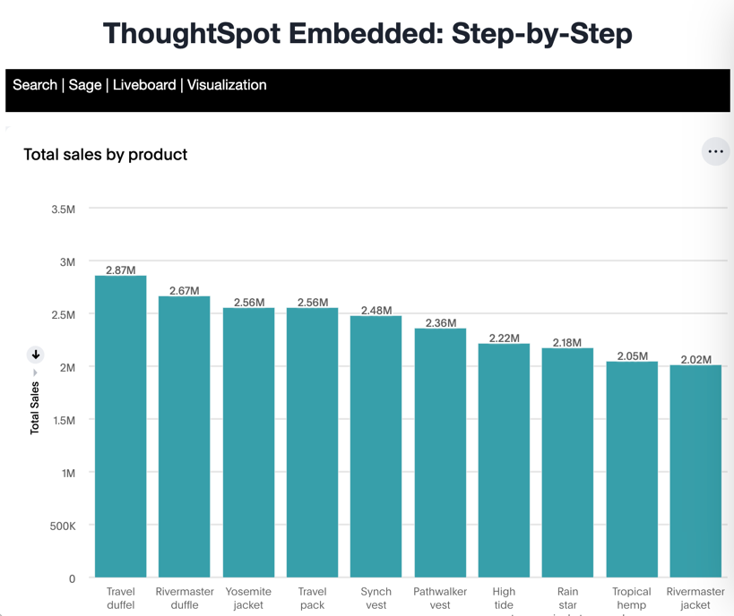

# Lesson 8 - Embed a Liveboard Visualization

In the previous lesson we embedded the full liveboard. In this lesson we'll embed a single visualizations from the
liveboard. NOTE: there are actually multiple ways to embed only some visualizations from a liveboard. The approach we
use here is
just to embed a visualization with no header. You can also embed a liveboard and use
the [visibleVizs](https://developers.thoughtspot.com/docs/Interface_LiveboardViewConfig#_visiblevizs) option to show one
or more visualizations.

## Pre-Conditions

It's ideal if you've done all the lessons so far. You minimally will need to have set up the environment and code and
have an `init` method working (see [lesson 05](../lesson-05-embed-search/README-05.md)).

## Add a nav link and function for the liveboard visualization

In the `index.html` file add a new `<li>` for the separator and liveboard visualization. Your code should look like the
following. The links need to have an ID to add a listener.

~~~

    <ul id="ul-nav-links">
        <li id="search-link">Search</li> <!-- lesson 05 -->
        <li>|</li>
        <li id="sage-link">Sage</li>  <!-- lesson 06 -->
        <li>|</li>
        <li id="liveboard-link">Liveboard</li>  <!-- lesson 07 -->
        <li>|</li>
        <li id="liveboard-viz-link">Visualization</li>  <!-- lesson 08 -->
    </ul>

~~~

Now run the application, and you should see the new links. It doesn't do anything yet, but it's always good to test code
as we add functionality to find errors quickly. The UI could use some style work to make it easier to read, but this
layout is sufficient to learn TSE.

## Add a listener for the liveboard links

In `tse.js` add the following line of code. It adds a listener for the click events, so when the user clicks, it will
call the `onVisualization` function. Go ahead and add this line after the one we added for the `liveboard-link`.

~~~
document.getElementById('liveboard-viz-link').addEventListener('click', onVisualization);
~~~

Now we have to add the function to get called. After the close of the `onLiveboard` function, add the following
function. Right now it only shows a comment in the console, but that will tell you that it's being called.

~~~
const onVisualization = () => {
  console.log('visualization clicked');
}
~~~

Refresh the application and click on each link. You should see a message in the console window of the developer tools.
If not, check for errors. You can also reference the example code (in the src folder).

The liveboard visualization uses the same LiveboardEmbed we used in the previous lesson, so no additional import is
required.

## Generate a liveboard visualization to embed

Navigate to the visual embed SDK playground and select "Liveboard" from the dropdown on the top left. You should see
something like the
following. As with the liveboard, you will be prompted to select a liveboard and visualization.

Since this uses the same `LiveboardEmbed` component, it has the same options as the liveboard _except_ the `full height`
option is not available. While you can set the full height flag, it will be ignored.

Select a liveboard from the dropdown, and you should see a `liveboardId` added to the code. Click run, and you should
see the full liveboard show up in the right-hand panel. That's because we are using the `LiveboardEmbed component` and
haven't selected the visualization.

Now select a visualization from the dropdown. This dropdown only shows the visualizations for the selected Liveboard.
Click run and you should see just the one visualization and none of the other liveboard artifacts, such as the header.

## Embed the liveboard visualization into the application

As with the previous embeds we'll just copy the code from the playground into the application. Copy the component
creation section. Paste this code into the `onVisualization` function. Then update the embed ID and add the call
to `render`. The following shows the complete function with comments removed.

~~~
const onVisualization = () => {
  const embed = new LiveboardEmbed("#embed", {
    frameParams: {},
    liveboardId: "0dc92611-2643-4c3e-a7c3-e7e421af9fd1",
    vizId: "9bf48c6e-4d2a-4817-9417-e62c0cff184d",
  });

  embed.render();
};
~~~

## Test the liveboard visualization embed

The last step is to test the embedded liveboard. Simply refresh the application (with cache disabled), then click
the `Visualization` link, and you should get something like the following:

## Activities

1. Add the nav link and handler to your code
2. Use the playground to create the visualization embed
3. Copy and paste the generated code (adding render()) into your application
4. Test the code

If you run into problems, you can look at the code in the `src` folder in this section.

## Files changed

* index.html
* tse.js

[< prev](../lesson-07-embed-liveboard/README-07.md) | [next >](../lesson-09-embed-full-app/README-09.md)
