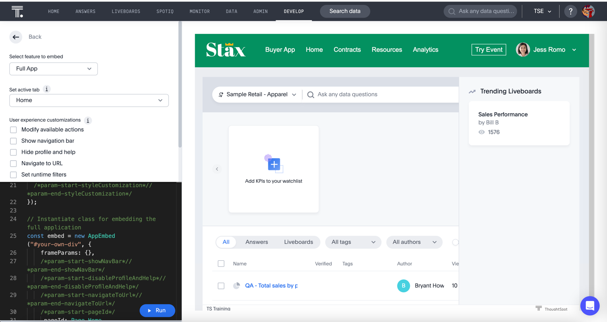

# Lesson 9 - Embed the Full ThoughtSpot Application

The final visual embed SDK component allows us to embed the full ThoughtSpot application.
In this lesson we'll embed the ThoughtSpot application. In this case, we'll be using the `AppEmbed` component.

## Pre-Conditions

It's ideal if you've done all the lessons so far. You minimally will need to have set up the environment and code and
have an `init` method working (see [lesson 05](../lesson-05-embed-search/README-05)).

## Add a nav link and function for the full app

First we want to a nav links to the nav bar. In the `index.html` file add a new `<li>` for the application. Your
code should look like the following. The link needs to have an ID to add a listener.

~~~

    <ul id="ul-nav-links">
        <li id="search-link">Search</li> <!-- lesson 05 -->
        <li>|</li>
        <li id="sage-link">Sage</li>  <!-- lesson 06 -->
        <li>|</li>
        <li id="liveboard-link">Liveboard</li>  <!-- lesson 07 -->
        <li>|</li>
        <li id="liveboard-viz-link">Visualization</li>  <!-- lesson 08 -->
        <li>|</li>
        <li id="full-app-link">Application</li>  <!-- lesson 09 -->
    </ul>

~~~

Now run the application, and you should see the new link. It only adds the link to the navigation bar, but we know it's
showing up.

## Add a listener for the application links

In `tse.js` add the following line of code. It adds a listener for the click events, so when the user clicks, it will
call the `onApplication` function. Go ahead and add this line after the one we added for the `visualization-link`.

~~~
document
  .getElementById("full-app-link")
  .addEventListener("click", onApplication);
~~~

Now we have to add the function to get called. After the close of the `onVisualization` function, add the following
function. Right now it only shows a comment in the console, but that will tell you that it's being called.

~~~
const onApplication = () => {
  console.log('application clicked');
}
~~~

Refresh the application and click on the Application link. You should see a message in the console window of the
developer tools. If not, check for errors. You can also reference the example code (in the src folder).

## Add the AppEmbed to the import

In order to use the `AppEmbed` component, we need to import it. At the top of the file, add AppEmbed to the list of
components. We are also going to use the enumerated type `Page`, so add that. This type will be described below. You
should now have an import like the following:

~~~
import {
  init,
  Action,
  AppEmbed,
  AuthType,
  LiveboardEmbed,
  Page,
  SearchEmbed,
  SageEmbed,
} from "https://unpkg.com/@thoughtspot/visual-embed-sdk/dist/tsembed.es.js";
~~~

## Generate an application embed

The same way you created other components in the playground, we'll create an app embed. Navigate to the visual embed SDK
playground and select "Full App" from the dropdown on the top left. You should see something like the following. By
default, the Home page is shown.

The `AppEmbed` has a number of different options, some that you've seen in other components and some that are `AppEmbed`
specific. The following are each of the application options and what they are used for:

* Set active tab. You can set this value from the dropdown to start on any of the main pages in the UI. These are
  equated to the [Page.xxx](https://developers.thoughtspot.com/docs/full-embed) enumerated values.
* Modify available actions. This option is the same as for other Embed objects and lets you control what is displayed.
  The difference is that it applies across all pages.
* Show navigation bar. By default, the top navigation bar is not displayed. This means that you will need to provide
  your own navigation. If you want to just easily embed with navigation check this box, which
  sets `showPrimaryNavbar: true`.
* Hide profile and help. When the navigation bar is displayed, it will also show the Help and Profile by default. You
  can disable this by setting `disableProfileAndHelp: true`.
* Navigate to URL. This feature is used instead of the `pageId` parameter to navigate to any specific page in the
  application. This is mostly used to navigate to specific SpotIQ analysis, which don't have their own embed object.
* Set runtime filters. As with Liveboards and Visualizations, you can set the runtime filters. This setting will impact
  any liveboard that is shown. Note that it's based on the column name, so it may not make sense.
* Handle custom action. This final option allows you to handle custom actions, which we will explore in a future lesson.

Let's create the full app component we want to embed. In this case, we're just going to embed the vanilla Home page with
no navigation bar.

Select the Full App and you should have Home already pre-selected. No additional changes are required.

## Embed ThoughtSpot into the application

All that's required is to copy the code into the application. Copy the component creation section. It will look like the
following. Comments have been removed. Paste this code into the `onApplication` function. You don't actually need the
frameParams parameter, so that means you can embed ThoughtSpot with only three lines of code.

~~~
const embed = new AppEmbed("#embed", {
  frameParams: {},
  pageId: Page.Home,
});
~~~

Now we just need to render the component, so it shows up. Failure to add this step results in an empty embed area.

`embed.render();`

The completed `onApplication` should look something like the following.

~~~
const onApplication = () => {
  const embed = new AppEmbed("#embed", {
    frameParams: {},
    pageId: Page.Home,
  });

  embed.render();
}
~~~

## Test the application embed

The last step is to test the embedded application. Simply refresh the application (with cache disabled), then click
the `Application` link. You should get something like the following:

## Activities

1. Add the nav link and handler to your code
2. Import the AppEmbed component and Page enumeration
3. Use the playground to create the app embed component
4. Copy and paste the generated code (adding render()) into your application
5. Test the code

If you run into problems, you can look at the code in the `src` folder in this section.

## Files changed

* index.html
* tse.js

[< prev](../lesson-08-embed-liveboard-viz/README-08.md) | [next >](../lesson-10-style-embedded-thoughtspot/README-10.md)
