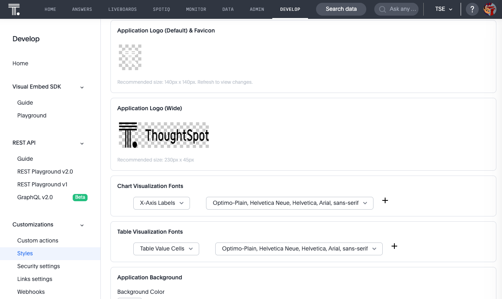
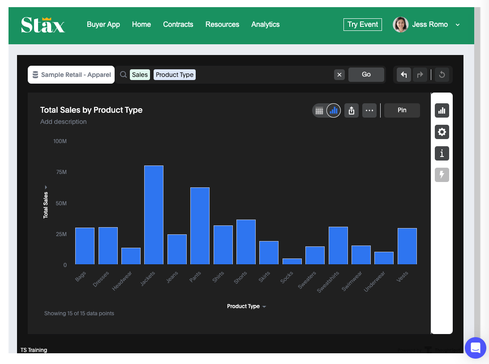

# Lesson 10 - Styling Embedded ThoughtSpot Content

Now that we've covered the primary ways you can embed ThoughtSpot, let's talk about how you can change the look and feel
of the embedded content. We aren't going to change the style as part of this lesson, but you should feel free to try it
in your cluster if you desire.

We'll cover styling in two ways:

1. What style you can apply in the UI.
2. What custom style you can apply via a CSS file.

## Pre-Conditions

You need to be logged in as a developer or administrator in ThoughtSpot to view the style page.

## Changing style in the UI

If you navigate to the `Develop -> Styles` page in ThoughtSpot you will see a form similar to the following. It allows
you to change a limited number of style options. Commonly changed style items are:

* Change the top left logo and favicon
* Change the color pallet of for charts
* Some limited font styles such as chart labels (but not other text like names and descriptions)
* Adding a footer for embedded text or changing the page title in the browser

Some of these changes should be well tested. For example, you can change the background color of the navigation menu to
any color you want, but not the foreground color. So if you set it to a light color such as white or grey, users will
have a hard time reading the text.

See the [ThoughtSpot documentation](https://docs.thoughtspot.com/cloud/latest/style-customization) for more details
about each setting.

## Using the customizations setting

The visual embed SDK allows you to set a custom style sheet or custom variables (or a combination of both). Full details
can be found in the [Developer Documentation](https://developers.thoughtspot.com/docs/Interface_CustomisationsInterface)

The code fragment below is what's generated if you select the `Apply custom styles` option in any embed. Note that the
customizations can be part of the init and apply to all embes, or part of the individual embedded object if you only
want to style one object.

~~~
customizations: {
  style: {
    customCSSUrl: "https://cdn.jsdelivr.net/gh/thoughtspot/custom-css-demo/css-variables.css", // location of your style sheet

    // To apply overrides for your style sheet in this init, provide variable values below, eg
    customCSS: {
      variables: {
        "--ts-var-button--secondary-background": "#F0EBFF",
        "--ts-var-button--secondary--hover-background": "#E3D9FC",
        "--ts-var-root-background": "#F7F5FF",
      },
    },
  },
},
~~~

The `customCSSUrl` allows you to specify a path to a style sheet. The URL must have an entry in the security settings
for the CSP-styles. The `customCSS` option allows you to specify individual variables instead of a style sheet.
The [Developers documentation](https://developers.thoughtspot.com/docs/custom-css) contains a list of all the current
variables.

### Creating and applying a style sheet

The [Developer documentation](https://developers.thoughtspot.com/docs/custom-css#_sample_css_file_with_variable_definitions)
provides an example style sheet that you can copy and modify to get started. Simply copy this into your own CSS file and
modify as desired. Then you need to deploy to a location that ThoughtSpot can access and make sure the URL is enabled in
the Developer -> Security settings.

The following code snippet shows an example of using a custom style sheet. This one is hosted in GitHub and uses
jsdelivr as a CDN to host the file.

~~~
customizations: {
  style: {
    customCSSUrl: "https://cdn.jsdelivr.net/gh/nrentz-ts/css/dark-theme.css", // location of your style sheet
  },
}
~~~

If you apply this style and refresh the page, you get the following:

### Additional style options

The majority of the style is related to colors and fonts. The custom styles also support custom sprites, such as
replacing the different icons in the UI. You can also modify text strings in the embedded content, such as renaming
Liveboards to Dashboard. See
the [Developer documentation](https://developers.thoughtspot.com/docs/custom-css#_customize_text_strings) for more
details.

## Activities

1. Look at the different options on the style settings page.
2. Review the [Developer documentation](https://docs.thoughtspot.com/cloud/latest/style-customization) for style settings.
3. If you like, create and use a custom CSS style sheet.

## Files changed

* None

[< prev](../lesson-09-embed-full-app/README-09.md) | [next >](../lesson-11-summary/README-11.md)
