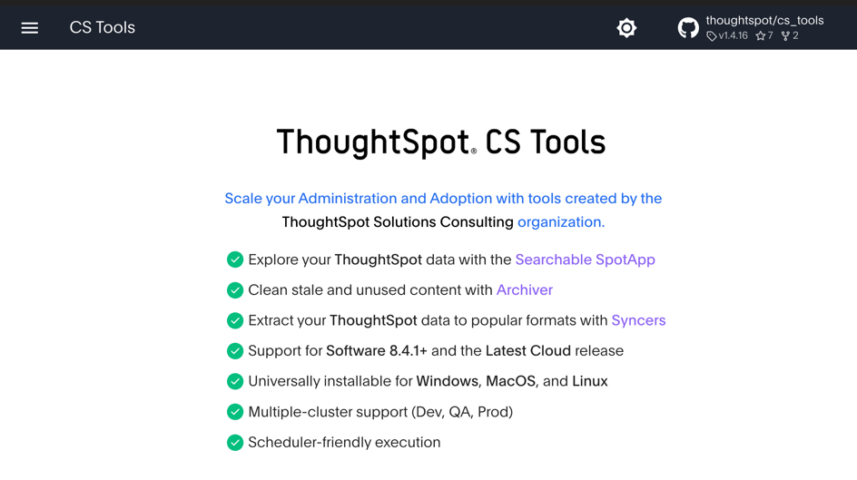
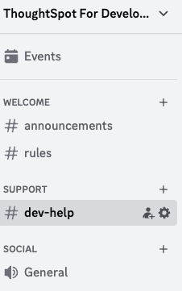

# Course Summary

In this course we covered a lot of topics related to embedding ThoughtSpot into your own applications to give the
analytics power to the end users. We covered the high-level concepts such as setup and security, as well as doing
detailed implementations of the different types of embedding. And finally finished up with a discussion of custom
styles.

We hope you enjoyed this course and learned a lot. TSE is an area of key focus for ThoughtSpot, and we continue to add
additional capabilities to give you even more control. You can expect to see updates on a regular (approximately
monthly) basis. To stay abreast of new features, be sure to monitor
the [release notes](https://developers.thoughtspot.com/docs/whats-new) on the developer site.

# Additional Topics

This course focused on embedding ThoughtSpot visualizations. Additional topics you may want to explore that weren't
covered here are. We also offer two additional, instructor led courses.

* [ThoughtSpot Embedded - Advanced Embedding for Javascript Developers](https://training.thoughtspot.com/thoughtspot-embedded-advanced-embedding-for-javascript-developers) -
  This course covers advanced embedding concepts such as trusted authentication, bidirectional messaging, and custom
  actions.
* [ThoughtSpot Embedded - Using ThoughtSpot REST APIs] - This course covers ThoughtSpot REST endpoints with hand's on
  exercises using Python.

## CS Tools

[CS Tools](https://thoughtspot.github.io/cs_tools) is not technically part of ThoughtSpot Embedded. But it's useful
enough to mention here. CS Tools is a community supported set of open source tools that allow you to do things like
extract usage information, automate TML activities, and more easily manage users, etc. See
the [list of tools](https://thoughtspot.github.io/cs_tools/tools/) for the current capabilities. And if you
are interested, you can even contribute ideas and code.

# Next Steps

## Developers Portal

The [Developers Portal](https://developers.thoughtspot.com) is the site where customers and non-customers alike can find
information about ThoughtSpot. In particular, you'll find [CodeSpot](https://developers.thoughtspot.com/codespot) on the
Developer's portal that has code examples showing how to do different things as well as downloadable examples. It's
another great place to stay informed and involved.

## Join Our Discord Server

ThoughtSpot also has a Discord Server. This server is beneficial because the response is usually pretty fast, and it
includes variety of people, including ThoughtSpot field and engineers, as well as partners and customers.

)

## Join Community

Finally, if you haven't already, I highly recommend joining the [ThoughtSpot community](https://community.thoughtspot.com). Here
you'll find knowledge articles on an ever expanding set of topics from embedding specific, to security and usage. You'll
also have the chance to ask questions and get responses from ThoughtSpot employees as well as partners and other
customers who are doing similar things. It's also where you enter support tickets and made feature recommendations.
Finally, we post about upcoming events and important activities. It's a great place to get connected and stay informed.

[< prev](../lesson-10-style-embedded-thoughtspot/README-10.md)
